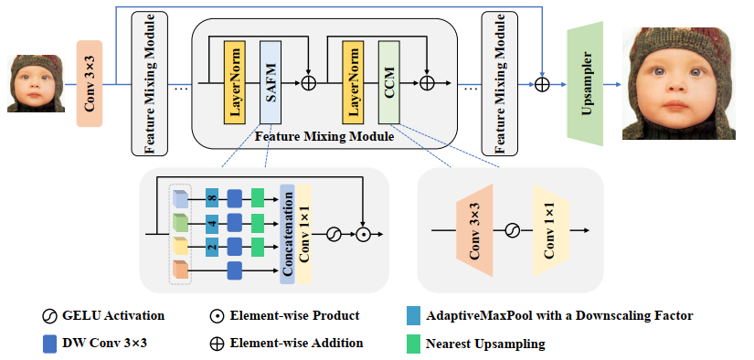
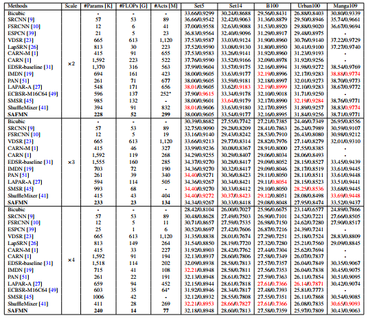
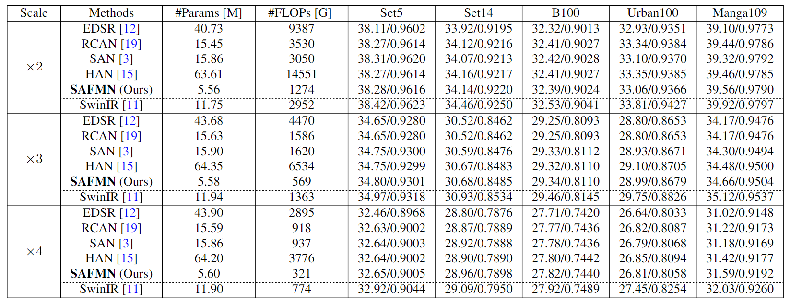
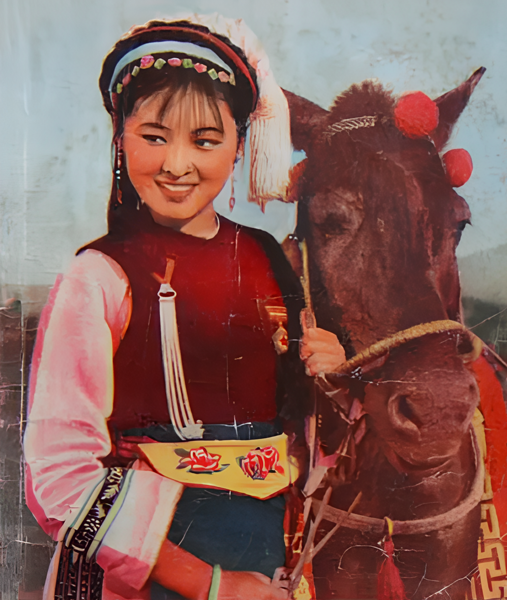

### 📖 Spatially-Adaptive Feature Modulation for Efficient Image Super-Resolution
> <a href="https://colab.research.google.com/drive/19DdsNFeOYR8om8QCCi9WWzr_WkWTLHZd?usp=sharing"></a>
[](https://openxlab.org.cn/apps/detail/Melokyyy/SAFMN)
[](https://huggingface.co/Meloo/SAFMN/tree/main)
[](https://www.bilibili.com/video/BV1Hc411Q7uD/?t=7000)

[](https://github.com/sunny2109/SAFMN) <br>
> [[Paper](https://openaccess.thecvf.com/content/ICCV2023/papers/Sun_Spatially-Adaptive_Feature_Modulation_for_Efficient_Image_Super-Resolution_ICCV_2023_paper.pdf)] &emsp;
[[Supp](https://openaccess.thecvf.com/content/ICCV2023/supplemental/Sun_Spatially-Adaptive_Feature_Modulation_ICCV_2023_supplemental.pdf)]  &emsp;
[[Poster](https://github.com/sunny2109/SAFMN/blob/main/figs/poster_iccv23_SAFMN.pptx)] <br>

> [Long Sun](https://github.com/sunny2109), [Jiangxin Dong](https://scholar.google.com/citations?user=ruebFVEAAAAJ&hl=zh-CN&oi=ao), [Jinhui Tang](https://scholar.google.com/citations?user=ByBLlEwAAAAJ&hl=zh-CN), and [Jinshan Pan](https://jspan.github.io/) <br>
> [IMAG Lab](https://imag-njust.net/), Nanjing University of Science and Technology


---
<p align="center">
  
</p>

*An overview of the proposed SAFMN. SAFMN first transforms the input LR image into the feature space using a convolutional layer, performs feature extraction using a series of feature mixing modules (FMMs), and then reconstructs these extracted features by an upsampler module. The FMM block is mainly implemented by a spatially-adaptive feature modulation (SAFM) layer and a convolutional channel mixer (CCM).*

---
### News
- [2023-11-22] The code for ONNX export is available [here](https://github.com/sunny2109/SAFMN/tree/main/scripts/to_onnx)
- [2023-09-08] Integrated to :panda_face: [OpenXLab](https://openxlab.org.cn/apps). Try out online demo! [](https://openxlab.org.cn/apps/detail/Melokyyy/SAFMN)
- [2023-08-31] Update [SAFMN_Real_x4.pth](https://github.com/sunny2109/SAFMN/releases/download/v0.1.0/SAFMN_L_Real_LSDIR_x4-v2.pth)
- [2023-08-31] Add [SAFMN_Real_x2.pth](https://github.com/sunny2109/SAFMN/releases/download/v0.1.0/SAFMN_L_Real_LSDIR_x2.pth)
- [2023-08-21] Colab demo for SAFMN on x4 real-world image SR is available <a href="https://colab.research.google.com/drive/19DdsNFeOYR8om8QCCi9WWzr_WkWTLHZd?usp=sharing"></a>
- [2023-07-14] Our SAFMN is accepted to ICCV 2023
- [2023-06-06] The report of NTIRE 2023 Challenge on Efficient Super-Resolution is available [here](https://openaccess.thecvf.com/content/CVPR2023W/NTIRE/papers/Li_NTIRE_2023_Challenge_on_Efficient_Super-Resolution_Methods_and_Results_CVPRW_2023_paper.pdf)
- [2023-04-17] The SAFMN ranks Top6 for overall performance in the NTIRE2023 ESR challenge.
- [2023-04-17] The SAFMN variant ranks Top3 for model complexity in the NTIRE2023 ESR Challenge.
- [2023-03-22] The code and checkpoint for the NTIRE2023 Efficient Super-Resolution Challenge is available [here](https://github.com/sunny2109/SAFMN/tree/main/NTIRE2023_ESR).
- [2023-03-22] The pre-trained model with high-order degradation on the LSDIR dataset is available.
- [2023-03-13] The source codes, checkpoints and visual results are available.
- [2023-02-26] The paper is available [here](https://arxiv.org/pdf/2302.13800.pdf).

---
### Requirements
> - Python 3.8, PyTorch >= 1.11
> - BasicSR 1.4.2
> - Platforms: Ubuntu 18.04, cuda-11

### Installation
```
# Clone the repo
git clone https://github.com/sunny2109/SAFMN.git
# Install dependent packages
cd SAFMN
pip install -r requirements.txt
# Install BasicSR
python setup.py develop
```
You can also refer to this [INSTALL.md](https://github.com/XPixelGroup/BasicSR/blob/master/docs/INSTALL.md) for installation

### Training
Run the following commands for training:
```
# train SAFMN for x4 effieicnt SR
python basicsr/train.py -opt options/train/SAFMN/train_DF2K_x4.yml
# train SAFMN for x4 classic SR
python basicsr/train.py -opt options/train/SAFMN/train_L_DF2K_x4.yml
```
### Testing 
- Download the pretrained models.
- Download the testing dataset.
- Run the following commands:
```
# test SAFMN for x4 efficient SR
python basicsr/test.py -opt options/test/SAFMN/test_benchmark_x4.yml
# test SAFMN for x4 classic SR
python basicsr/test.py -opt options/test/SAFMN/test_L_benchmark_x4.yml
# test SAFMN for x4 real-world SR (without ground-truth)
python basicsr/test.py -opt options/test/SAFMN/test_real_img_x4.yml
# test SAFMN for x4 real-world SR (large input)
python inference/inference_real_safmn.py --input test_demo --output results/test_demo --scale 4 --large_input 
```
- The test results will be in './results'.

### Results
- **Pretrained models and visual results**

  We have provided three ways to download our checkpoints.
    -  1.Download via the Google Drive links shown below.
    -  2.Download via the Baidu Netdisk links shown below.
    -  3.Visit our huggingface repo at https://huggingface.co/Meloo/SAFMN/tree/main and click the download icons.

| Degradation | Model Zoo| Visual Results| 
| :----- |:-----: |:-----: |
| BI-Efficient SR | [Google Drive](https://drive.google.com/drive/folders/12O_xgwfgc76DsYbiClYnl6ErCDrsi_S9?usp=share_link)/[Baidu Netdisk](https://pan.baidu.com/s/1mKXahFifHaF14pc1pBWFOg) with code: SAFM | [Google Drive](https://drive.google.com/drive/folders/1s3vJQXDACr799khLLs1ELWL-neljx5vL?usp=share_link)/[Baidu Netdisk](https://pan.baidu.com/s/17q_OuNVTgy7QhtbFu099Jg) with code: SAFM |
| BI-Classic SR | [Google Drive](https://drive.google.com/drive/folders/12O_xgwfgc76DsYbiClYnl6ErCDrsi_S9?usp=share_link)/[Baidu Netdisk](https://pan.baidu.com/s/10jtlG-FYfB8KwYfWsQDOMA) with code: SAFM | [Google Drive](https://drive.google.com/drive/folders/1s3vJQXDACr799khLLs1ELWL-neljx5vL?usp=share_link)/[Baidu Netdisk](https://pan.baidu.com/s/1fYsZ67MNLpPs7OAS9Dn2-w) with code: SAFM |
| x4 [Real-world](https://github.com/xinntao/Real-ESRGAN) |[Google Drive](https://drive.google.com/drive/folders/12O_xgwfgc76DsYbiClYnl6ErCDrsi_S9?usp=share_link)/[Baidu Netdisk](https://pan.baidu.com/s/10jtlG-FYfB8KwYfWsQDOMA) with code: SAFM |  |

- **Efficient SR Results**


- **Classic SR Results**


- **Real-world SR Results**

|Real-World Image (x4)|Real-ESRGAN  |SwinIR     | SAFMN (ours)|
|       :---          |     :---:   |  :-----:  |  :-----:    |        
| |||
| |||
| |||
| |||

[](https://imgsli.com/MTkwMzE2/6/7) 


### Citation
If this work is helpful for your research, please consider citing the following BibTeX entry.
```
@inproceedings{sun2023safmn,
    title={Spatially-Adaptive Feature Modulation for Efficient Image Super-Resolution},
    author={Sun, Long and Dong, Jiangxin and Tang, Jinhui and Pan, Jinshan},
    booktitle={Proceedings of the IEEE/CVF International Conference on Computer Vision},
    year={2023}
 }
 ```


### Acknowledgement
This code is based on [BasicSR](https://github.com/XPixelGroup/BasicSR) toolbox. Thanks for the awesome work.

### Contact
If you have any questions, please feel free to reach me out at cs.longsun@gmail.com

