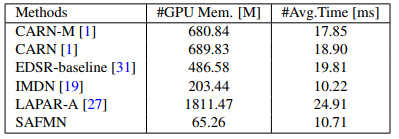
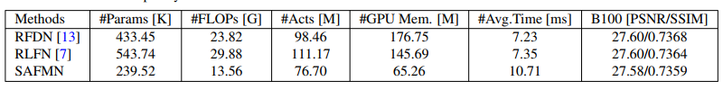

# Spatially-Adaptive Feature Modulation for Efficient Image Super-Resolution
[Long Sun](https://github.com/sunny2109), [Jiangxin Dong](https://scholar.google.com/citations?user=ruebFVEAAAAJ&hl=zh-CN&oi=ao), [Jinhui Tang](https://scholar.google.com/citations?user=ByBLlEwAAAAJ&hl=zh-CN), [Jinshan Pan](https://jspan.github.io/)

[IMAG Lab](https://imag-njust.net/), Nanjing University of Science and Technology

---
[](https://github.com/sunny2109/SAFMN)    [](https://arxiv.org/pdf/2302.13800.pdf)  


---
<p align="center">
  
</p>

*An overview of the proposed SAFMN. SAFMN first transforms the input LR image into the feature space using a convolutional layer, performs feature extraction using a series of feature mixing modules (FMMs), and then reconstructs these extracted features by an upsampler module. The FMM block is mainly implemented by a spatially-adaptive feature modulation (SAFM) layer and a convolutional channel mixer (CCM).*

### News
- [2023-03-20] The pre-trained model with high-order degradation on the LSDIR dataset is available.
- [2023-03-13] The source codes, checkpoints and visual results are available.
- [2023-02-26] The paper is available [here](https://arxiv.org/pdf/2302.13800.pdf)

### Requirements
> - Python 3.8, PyTorch == 1.11
> - BasicSR 1.4.2
> - einops: pip install einops
> - fvcore: pip install -U fvcore
> - Platforms: Ubuntu 18.04, cuda-11.

### Training
Run the following commands for training:
```
# train SAFMN for x4 effieicnt SR
python basicsr/train.py -opt options/train/SAFMN/train_DF2K_x4.yml
# train SAFMN for x4 classic SR
python basicsr/train.py -opt options/train/SAFMN/train_L_DF2K_x4.yml
```
### Testing 
- Download the pretrained models.
- Download the testing dataset.
- Run the following commands:
```
# test SAFMN for x4 efficient SR
python basicsr/test.py -opt options/test/SAFMN/test_benchmark_x4.yml
# test SAFMN for x4 classic SR
python basicsr/test.py -opt options/test/SAFMN/test_L_benchmark_x4.yml
# test SAFMN for x4 real-world SR (without ground-truth)
python basicsr/test.py -opt options/test/SAFMN/test_real_img_x4.yml
```
- The test results will be in './results'.

### Results
- **Pretrained models and visual results**

| Degradation | Model Zoo| Visual Results| 
| :----- |:-----: |:-----: |
| BI-Efficient SR | [Google Drive](https://drive.google.com/drive/folders/12O_xgwfgc76DsYbiClYnl6ErCDrsi_S9?usp=share_link)/[Baidu Netdisk](https://pan.baidu.com/s/1mKXahFifHaF14pc1pBWFOg) with code: SAFM | [Google Drive](https://drive.google.com/drive/folders/1s3vJQXDACr799khLLs1ELWL-neljx5vL?usp=share_link)/[Baidu Netdisk](https://pan.baidu.com/s/17q_OuNVTgy7QhtbFu099Jg) with code: SAFM |
| BI-Classic SR | [Google Drive](https://drive.google.com/drive/folders/12O_xgwfgc76DsYbiClYnl6ErCDrsi_S9?usp=share_link)/[Baidu Netdisk](https://pan.baidu.com/s/10jtlG-FYfB8KwYfWsQDOMA) with code: SAFM | [Google Drive](https://drive.google.com/drive/folders/1s3vJQXDACr799khLLs1ELWL-neljx5vL?usp=share_link)/[Baidu Netdisk](https://pan.baidu.com/s/1fYsZ67MNLpPs7OAS9Dn2-w) with code: SAFM |
| x4 [High-order](https://github.com/xinntao/Real-ESRGAN) |[Google Drive](https://drive.google.com/drive/folders/12O_xgwfgc76DsYbiClYnl6ErCDrsi_S9?usp=share_link)/[Baidu Netdisk](https://pan.baidu.com/s/10jtlG-FYfB8KwYfWsQDOMA) with code: SAFM |  |

- **Efficient SR Results**


- **Classic SR Results**


- **Real-world SR Results**

|Real-World Image (x4)|Real-ESRGAN  |SwinIR     | SAFMN (ours)|
|       :---          |     :---:   |  :-----:  |  :-----:    |        
| |||
| |||
| |||
| |||


- **Runtime Comparison**


- **Comparison with NTIRE Winners**



### Citation
If this work is helpful for your research, please consider citing the following BibTeX entry.
```
@article{sun2023safmn,
    title={Spatially-Adaptive Feature Modulation for Efficient Image Super-Resolution},
    author={Sun, Long and Dong, Jiangxin and Tang, Jinhui and Pan, Jinshan},
    journal={arXiv preprint arXiv:2302.13800},
    year={2023}
 }
 ```


### Acknowledgement
This code is based on [BasicSR](https://github.com/XPixelGroup/BasicSR) toolbox. Thanks for the awesome work.

