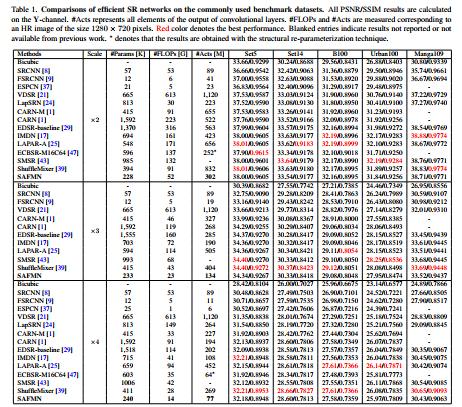
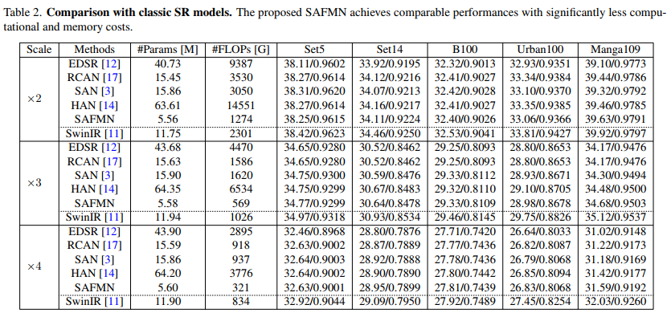

# SAFMN
Code for "Spatially-Adaptive Feature Modulation for Efficient Image Super-Resolution"

### Quantitative results 
  - Benchmark results 

| Degradation | Model Zoo| Visual Results| 
| :----- |:-----: |:-----: |
| BI | Efficient SR: [Google Drive](https://drive.google.com/drive/folders/12O_xgwfgc76DsYbiClYnl6ErCDrsi_S9?usp=share_link)/[Baidu Netdisk](https://pan.baidu.com/s/1mKXahFifHaF14pc1pBWFOg) with code: SAFM | [Google Drive](https://drive.google.com/drive/folders/1s3vJQXDACr799khLLs1ELWL-neljx5vL?usp=share_link)/[Baidu Netdisk](https://pan.baidu.com/s/17q_OuNVTgy7QhtbFu099Jg) with code: SAFM |
| BI | Classic SR: [Google Drive](https://drive.google.com/drive/folders/12O_xgwfgc76DsYbiClYnl6ErCDrsi_S9?usp=share_link)/[Baidu Netdisk](https://pan.baidu.com/s/10jtlG-FYfB8KwYfWsQDOMA) with code: SAFM | [Google Drive](https://drive.google.com/drive/folders/1s3vJQXDACr799khLLs1ELWL-neljx5vL?usp=share_link)/[Baidu Netdisk](https://pan.baidu.com/s/1fYsZ67MNLpPs7OAS9Dn2-w) with code: SAFM |
| x4 [High-order](https://github.com/xinntao/Real-ESRGAN) |[Google Drive](https://drive.google.com/drive/folders/12O_xgwfgc76DsYbiClYnl6ErCDrsi_S9?usp=share_link)/[Baidu Netdisk](https://pan.baidu.com/s/10jtlG-FYfB8KwYfWsQDOMA) with code: SAFM |  |

 

 

- Runtime comparison (1080P --> 4K)

| Method | Params [K] | FLOPs [G] | GPU Mem. [M] | Running Time [s]|
| :----- | :-----: | :-----: | :-----: |:-----: |
| IMDN | 715.18 | 1474.41| 7117.48 | 0.26 |
| RLFN | 543.74 | 1075.69| 4973.25 | 0.22 |
| SAFMN| 239.52 | 487.53 | 2304.03 | 0.30 |

